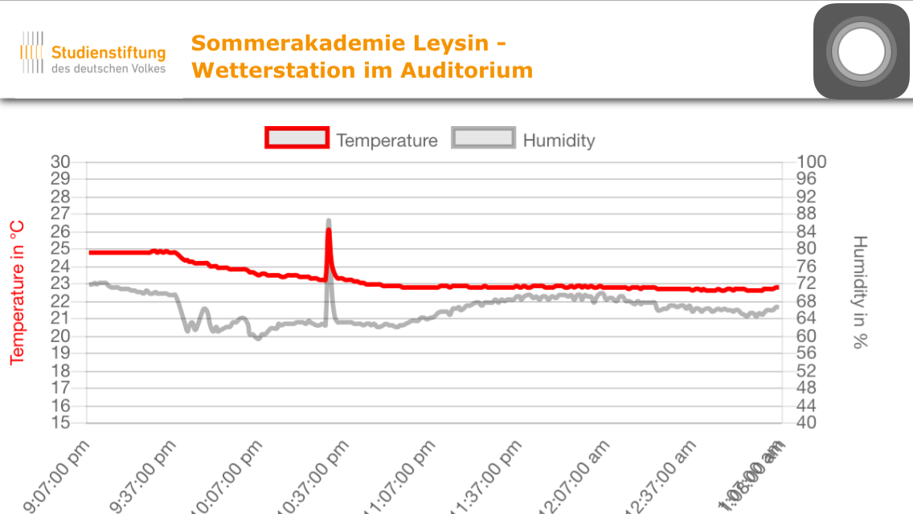
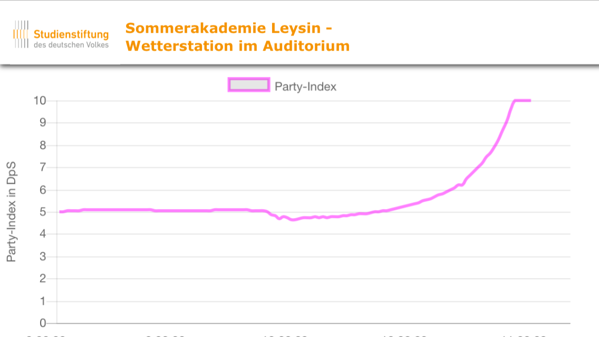

# NodeMCU-Sample
:cloud: The weather station sample using the NodeMCU and the Raspberry Pi 2.

Im Rahmen der AG2 - Effizientes Rechnen wurde im Auditorium unseres Seminarhauses eine „Wetterstation“ aufgestellt. Diese besteht aus einem [ESP-8266-Microcontroller](http://www.ebay.de/itm/like/401054497731?lpid=106&chn=ps&ul_noapp=true), der die Sensoren auswertet und auf einem kleinen Webserver zur Verfügung stellt. Auf einem kleinen selbstgeschriebenen Node.js Server auf einem Raspberry Pi im Gruppenraum der AG wurde der Sensor im Auditorium mittels HTTP-Request übers WLAN jede Minute nach seinen Daten gefragt. Die Sensoreinheit misst neben der Raumtemperatur auch die Luftfeuchtigkeit, sowie den Luftdruck und die Lautstärke. Diese Informationen sollten bis zum Ende der Akademie aufgenommen und gespeichert werden. Daraus wurde ein Party-Index berechnet, um über die Webseite verfolgen zu können, wann Vorträge oder auch Parties dort unten stattfanden und wie sich diese auf das Raumklima auswirkten.

**Table of Contents**

* [Teile](#Teile)
* [Sensoreinheit](#Sensor)
* [Einrichtung des ESP-8266](#ESP-Setup)
* [Einrichtung des RaspPi](#RasPi-Setup)
* [Frontend Visualisierung](#Frontend-Visualisierung)
